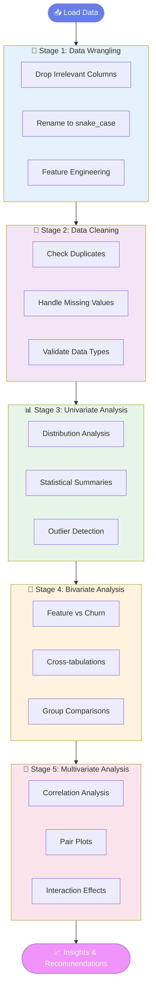
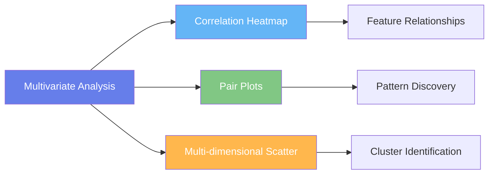

# EDA of Churn Modelling Dataset

## Problem Statement
Customer churn is a critical issue for banks as it directly impacts profitability and long-term growth. This dataset contains customer demographic details, financial information, and account activity data, along with a target variable indicating whether a customer has exited the bank.

The main objectives of this analysis are:
- To understand the overall structure and quality of the dataset.
- To identify patterns and trends related to customer churn.
- To analyze the relationship between customer attributes (age, gender, geography, balance, etc.) and churn behavior.
- To determine the key factors that contribute most to customer exit.
- To generate insights that can help improve customer retention strategies.

Exploratory Data Analysis (EDA) will help uncover meaningful insights and prepare the dataset for further predictive modeling.

## Project Objectives
The objectives of this project are to:
- Understand the dataset structure and variables
- Perform data wrangling and data cleaning
- Conduct univariate, bivariate, and multivariate analysis
- Identify patterns, trends, and anomalies
- Summarize insights for decision-making
- Provide conclusions and actionable recommendations

## Tools and Libraries
- Numpy
- Pandas
- Matplotlib
- Seaborn

## Dataset Information
**Dataset Source:** Kaggle – Bank Customer Churn / Churn Modelling Dataset

### Data Dictionary
| Column Name     | Description                                                            | Data Type   |
| --------------- | ---------------------------------------------------------------------- | ----------- |
| RowNumber       | Unique row identifier for each record                                  | Numerical   |
| CustomerId      | Unique customer identification number                                  | Numerical   |
| Surname         | Customer's last name                                                   | Text        |
| CreditScore     | Customer's credit score                                                | Numerical   |
| Geography       | Country where the customer resides (e.g., France, Germany, Spain)      | Categorical |
| Gender          | Customer's gender                                                      | Categorical |
| Age             | Customer's age                                                         | Numerical   |
| Tenure          | Number of years the customer has been with the bank                    | Numerical   |
| Balance         | Customer's account balance                                             | Numerical   |
| NumOfProducts   | Number of bank products the customer is using                          | Numerical   |
| HasCrCard       | Whether the customer has a credit card (1 = Yes, 0 = No)               | Categorical |
| IsActiveMember  | Whether the customer is an active member (1 = Yes, 0 = No)             | Categorical |
| EstimatedSalary | Estimated annual salary of the customer                                | Numerical   |
| Exited          | Whether the customer left the bank (1 = Yes, 0 = No) — Target Variable | Categorical |


## ⚙️ Methodology

<div align="center">

### *Five-Stage Analysis Pipeline*

</div>



---

### 1️⃣ Data Wrangling

<details>
<summary>Click to expand details</summary>

<br>

**Column Management:**
- ❌ Dropped irrelevant columns: `RowNumber`, `CustomerId`, `Surname`
- 🔄 Renamed all columns to standardized `snake_case` format

**Feature Engineering:**

Created two new categorical features for better segmentation:

| Feature | Bins | Categories | Purpose |
|---------|------|------------|---------|
| **age_group** | 18-30, 31-45, 46-60, 60+ | Young, Middle_Age, Senior, Elder | Identify age-related churn patterns |
| **tenure_group** | 0-3, 4-7, 8-10 | New_Customer, Mid_Term, Long_Term | Analyze loyalty vs churn behavior |

```python
# Age Groups
data["age_group"] = pd.cut(data["age"],
                          bins=[18, 30, 45, 60, 100],
                          labels=["Young", "Middle_Age", "Senior", "Elder"])

# Tenure Groups  
data["tenure_group"] = pd.cut(data["tenure"],
                             bins=[-1, 3, 7, 10],
                             labels=["New_Customer", "Mid_Term", "Long_Term"])
```

</details>

---

### 2️⃣ Data Cleaning

<details>
<summary>Click to expand details</summary>

<br>

| Task | Status | Result |
|------|--------|--------|
| 🔍 Check for duplicates | ✅ Complete | 0 duplicates found |
| 🔍 Identify missing values | ✅ Complete | 0 missing values |
| 🔍 Validate data types | ✅ Complete | All types correct |

**Data Quality Score: 100%** 🎯

</details>

---

### 3️⃣ Univariate Analysis

<details>
<summary>Click to expand details</summary>

<br>

**Analyzed individual variable distributions:**

<table>
<tr>
<td width="50%">

**📈 Numerical Variables:**
- Age distribution
- Credit score distribution
- Balance distribution
- Salary distribution
- Tenure distribution

</td>
<td width="50%">

**📊 Categorical Variables:**
- Geography distribution
- Gender distribution
- Churn distribution
- Active member status
- Credit card ownership

</td>
</tr>
</table>

**Key Findings:**
- ✓ Age: Slightly right-skewed, peak at 30-45 years
- ✓ Credit Score: Normal distribution (600-750)
- ✓ Balance: Highly skewed, many zero-balance accounts
- ✓ Churn: Class imbalance (80% retained, 20% churned)

</details>

---

### 4️⃣ Bivariate Analysis

<details>
<summary>Click to expand details</summary>

<br>

**Explored relationships between features and target variable:**

| Analysis | Variables | Visualization Type |
|----------|-----------|-------------------|
| 👤 Age vs Churn | Age, Churn | Box plot |
| 💰 Balance vs Churn | Balance, Churn | Box plot |
| 👥 Gender vs Churn | Gender, Churn | Stacked bar chart |
| 🌍 Geography vs Churn | Geography, Churn | Count plot |
| ⚡ Activity vs Churn | IsActiveMember, Churn | Bar plot |
| 📊 Credit Score vs Churn | CreditScore, Churn | Violin plot |
| ⏱️ Tenure vs Balance | Tenure, Balance | Line plot |
| 🔢 Age vs Balance | Age, Balance | Scatter plot |

</details>

---

### 5️⃣ Multivariate Analysis

<details>
<summary>Click to expand details</summary>

<br>

**Complex relationship exploration:**



- 🔥 **Correlation heatmap:** Identified feature inter-relationships
- 🎨 **Pair plots:** Visualized multi-variable interactions
- 📍 **Scatter plots:** Detected customer segments

</details>

---

## Key Insights
- Older customers are more likely to churn than younger customers.
- Inactive members show significantly higher churn rates compared to active members.
- Customers from Germany have a higher churn rate than other regions.
- Customers with higher account balances tend to churn more frequently.
- Credit score has a moderate influence on churn behavior.
- The dataset shows class imbalance, as most customers did not churn (~80% stayed, ~20% exited).

## Conclusion
- Age, activity status, geography, and balance are the key factors influencing churn.
- Customer engagement plays a crucial role in retention.
- Older and inactive customers form the high-risk churn segment.
- There is no strong multicollinearity among variables.
- The dataset is suitable for building a churn prediction model.
